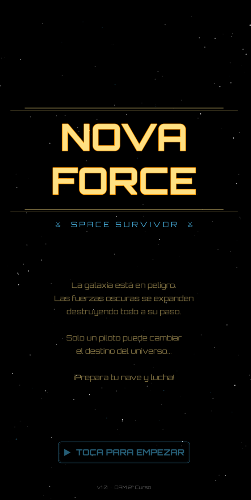
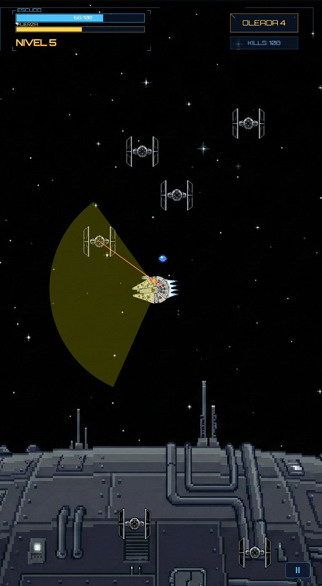
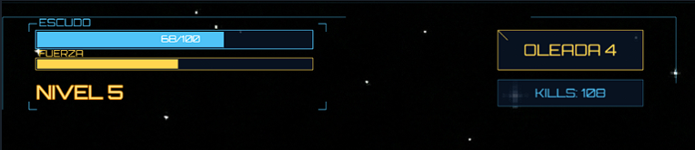
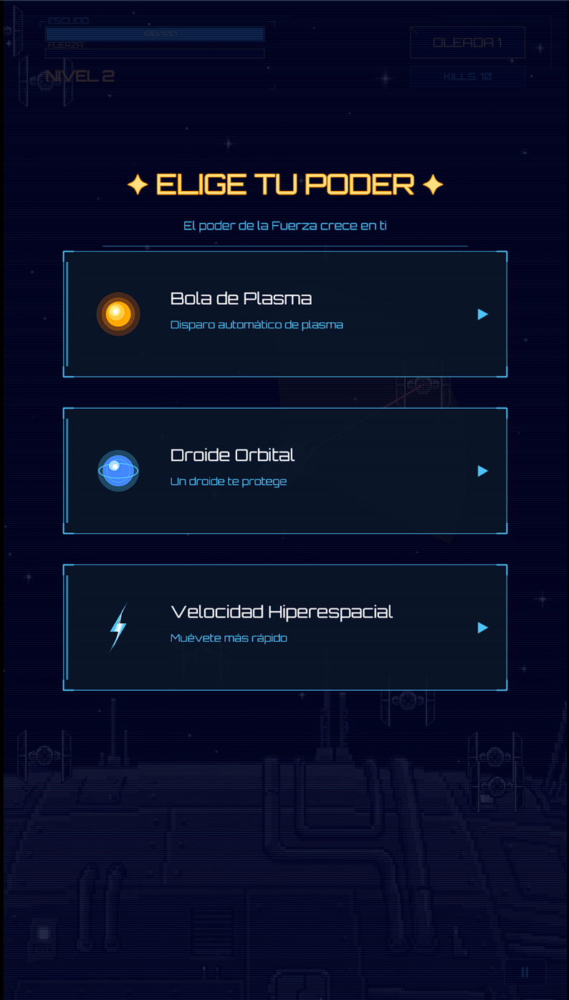
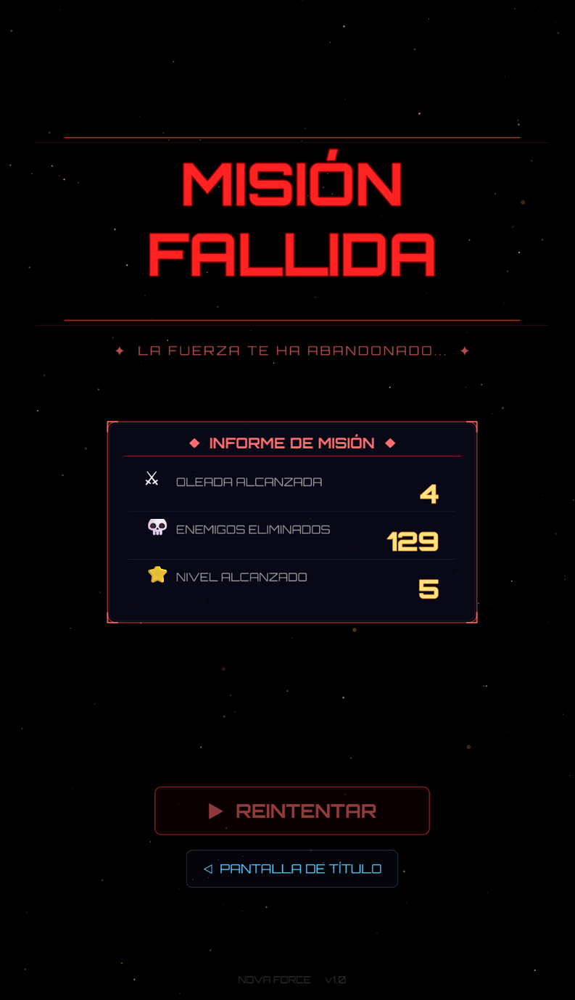

<p align="center">
  
</p>

<h1 align="center">⚔ NOVA FORCE ⚔</h1>

<p align="center">
  <em>Un juego de supervivencia espacial al estilo Star Wars</em><br>
  <strong>Género:</strong> Space Survivor (tipo Vampire Survivors) · <strong>Plataforma:</strong> Web / Móvil
</p>

<p align="center">
  
  
  
  
</p>

---

## 📖 Descripción

**Nova Force** es un juego de supervivencia espacial inspirado en el universo Star Wars, donde pilotas una nave y debes sobrevivir a oleadas interminables de cazas enemigos. Sube de nivel, elige mejoras y lucha por marcar el mayor número de kills.

Desarrollado con **Phaser 3** como proyecto de **Desarrollo de Aplicaciones Multimedia** (DAM 2º Curso).

---

## 🎮 Capturas de Pantalla

> **📸 Instrucciones para las capturas:**
> Crea una carpeta `screenshots/` en la raíz del proyecto y coloca las capturas con estos nombres.
> Usa la resolución del juego o haz capturas en el navegador.

### Pantalla de Título
<!-- 📸 CAPTURA: Espera a que aparezca el logo "NOVA FORCE" con las líneas doradas y el texto "TOCA PARA EMPEZAR" -->
<!-- Tip: Haz la captura justo cuando el logo ya apareció y se ve el crawl text -->
```
screenshots/title_screen.png
```
<p align="center">
  
</p>

### Gameplay — Combate
<!-- 📸 CAPTURA: Durante el juego con enemigos en pantalla, disparos láser visibles y el cono de ataque amarillo -->
<!-- Tip: Espera a tener varios enemigos cerca para que se vea la acción -->
```
screenshots/gameplay_combat.png
```
<p align="center">
  
</p>

### HUD e Interfaz
<!-- 📸 CAPTURA: Enfócate en la parte superior del juego mostrando la barra de escudo, XP, oleada y kills -->
<!-- Tip: Juega hasta oleada 2+ para que los contadores tengan valores interesantes -->
```
screenshots/hud_interface.png
```
<p align="center">
  
</p>

### Menú de Mejoras (Level Up)
<!-- 📸 CAPTURA: Cuando subas de nivel, captura el menú con las 3 opciones de mejora -->
<!-- Tip: Es la pantalla azul con los paneles holográficos "ELIGE TU PODER" -->
```
screenshots/level_up.png
```
<p align="center">
  
</p>

### Menú de Pausa
<!-- 📸 CAPTURA: Pulsa el botón ⏸ durante el juego para abrir el menú de pausa -->
<!-- Tip: Se ve el overlay oscuro con el panel holográfico cyan -->
```
screenshots/pause_menu.png
```
<p align="center">
  
</p>

### Pantalla de Game Over
<!-- 📸 CAPTURA: Déjate matar y espera a que aparezcan las estadísticas completas -->
<!-- Tip: Juega varias oleadas y mata enemigos para que el informe de misión tenga datos interesantes -->
```
screenshots/game_over.png
```
<p align="center">
  
</p>

---

## ✨ Características Principales

### 🚀 Jugabilidad
- **Control táctil/ratón**: Toca o haz clic para dirigir la nave
- **Ataque automático**: Disparo láser en cono frontal con proyectiles de plasma
- **Sistema de oleadas**: Dificultad creciente cada 30 segundos (más enemigos, más rápidos, más resistentes)
- **Object Pooling**: Sistema optimizado de reutilización de enemigos para rendimiento fluido

### ⚡ Sistema de Mejoras (4 poderes)
| Mejora | Descripción |
|--------|-------------|
| 🔫 **Cañón Láser +** | Aumenta el daño de los disparos |
| ⚡ **Velocidad Hiperespacial** | Incrementa la velocidad de movimiento |
| 🔵 **Droide Orbital** | Un orbe que gira protegiendo la nave |
| 🟡 **Bola de Plasma** | Disparo automático de proyectiles adicionales |

### 🎨 Estética Star Wars
- **Pantalla de título cinemática**: Secuencia "Hace mucho tiempo..." → logo con zoom dramático → crawl text
- **HUD holográfico**: Barras de escudo/XP, indicador de oleada, contador de kills
- **Menú de pausa**: Panel holográfico con líneas de escaneo
- **Game Over cinemático**: Flash rojo, "MISIÓN FALLIDA" con shake, informe de misión con estadísticas
- **Explosiones vectoriales**: Partículas procedurales al destruir enemigos

### 🔊 Audio
- **Banda sonora**: Star Wars Main Theme como música de fondo
- **Efectos procedurales** (Web Audio API):
  - Blaster láser (el icónico "pew!")
  - Impacto en escudo eléctrico
  - Fanfarria de subida de nivel
  - TIE Fighter flyby al iniciar nueva oleada
  - Beep holográfico al seleccionar mejoras

---

## 🛠 Tecnologías

| Tecnología | Uso |
|------------|-----|
| **Phaser 3** | Motor del juego (físicas arcade, escenas, tweens) |
| **JavaScript ES6+** | Lógica del juego con clases y módulos |
| **Vite** | Bundler y servidor de desarrollo |
| **Web Audio API** | Síntesis procedural de efectos de sonido |
| **Google Fonts** | Tipografía Orbitron para el estilo sci-fi |

---

## 📁 Estructura del Proyecto

```
VideojuegoMultimedia/
├── index.html              # Punto de entrada HTML
├── package.json            # Dependencias (Phaser 3)
├── public/
│   ├── assets/
│   │   ├── spritesheetNave.png     # Spritesheet del jugador (4 frames)
│   │   ├── enemy.png               # Sprite del enemigo
│   │   ├── explosionPixelArt.png   # Spritesheet de explosión
│   │   ├── explosion.mp3           # Sonido de explosión
│   │   └── space_bg.png            # Fondo espacial
│   └── Star Wars Main Theme.mp3   # Música de fondo
└── src/
    ├── main.js             # Configuración de Phaser y escenas
    ├── SoundFX.js          # Efectos de sonido procedurales (Web Audio)
    ├── entities/
    │   ├── Player.js       # Nave del jugador (movimiento, ataque, mejoras)
    │   └── Enemy.js        # Enemigos (IA, pooling, explosiones)
    └── scenes/
        ├── Boot.js         # Carga de assets
        ├── Title.js        # Pantalla de título (estilo Star Wars)
        ├── Game.js         # Escena principal del juego
        ├── UI.js           # HUD (barras, oleada, kills)
        ├── LevelUp.js      # Menú de selección de mejoras
        ├── Pause.js        # Menú de pausa
        └── GameOver.js     # Pantalla de fin de partida
```

---

## 🚀 Instalación y Ejecución

```bash
# 1. Clonar el repositorio
git clone https://github.com/tu-usuario/nova-force.git
cd nova-force

# 2. Instalar dependencias
npm install

# 3. Ejecutar servidor de desarrollo
npm run dev

# 4. Abrir en el navegador
# → http://localhost:5173
```

---

## 🎯 Cómo Jugar

1. **Toca/Haz clic** en la pantalla de título para comenzar
2. **Arrastra/Mueve el ratón** con clic para dirigir tu nave
3. Tu nave **dispara automáticamente** al enemigo más cercano en su cono de ataque
4. **Mata enemigos** para ganar XP y subir de nivel
5. Al subir de nivel, **elige una mejora** de las 3 disponibles
6. **Sobrevive** el mayor número de oleadas posible
7. Pulsa **⏸** (esquina inferior derecha) para pausar

---

## 👨‍💻 Autor

**Desarrollo de Aplicaciones Multimedia** — DAM 2º Curso

---

<p align="center">
  <em>Que la Fuerza te acompañe. ✦</em>
</p>
